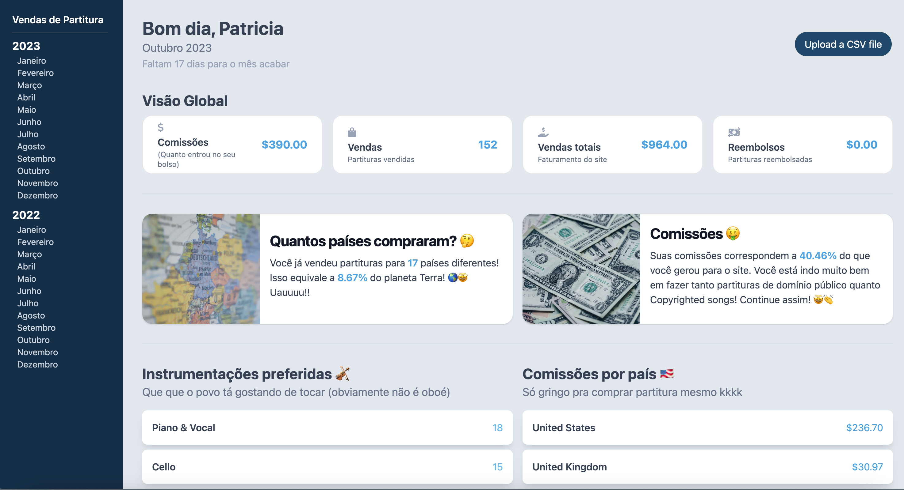

# Arrangeme Advanced Dashboard

## Introduction

Arrangeme offers a platform where artists and musicians can sell their sheet music. While the platform is feature-rich, the built-in dashboard may sometimes not provide a deep dive into the sales data that users might be interested in. Recognizing this, the Arrangeme Advanced Dashboard was developed using Angular, SCSS, and HTML. It provides an enhanced perspective into your sales, ensuring you get the most out of your data.

## Features

- **CSV Import Functionality**: The dashboard allows users to import their sales data in CSV format. This means you can seamlessly transition from the standard Arrangeme platform to this advanced dashboard without any data loss or manual entry.
- **Detailed Sales Overview**: Get a comprehensive view of your total sales, estimated commissions, total quantity of products sold, and total refunds.
- **Country-wise Analysis**: Understand your audience better with insights on sales and quantity based on countries. This can help in targeted marketing and understanding where your music is popular.
- **Most Used Formats**: Get insights on which music format is the most popular amongst your buyers. This can guide decisions on which formats to focus on in future compositions.
- **Error Handling**: The dashboard is built to handle errors gracefully. Any inconsistencies or issues in the data will be logged, ensuring that your experience is smooth and informative.

## How to Use

1. **Import Data**: Start by importing your CSV file containing the sales data.
2. **Navigate**: Use the intuitive interface to navigate through different metrics and insights.
3. **Analyze & Strategize**: Based on the data, make informed decisions on your next steps, be it marketing, composing in specific formats, or targeting specific countries.

## Conclusion

The Arrangeme Advanced Dashboard is designed to empower musicians with detailed insights from their sales data. By bridging the information gap, it aims to provide a more wholesome experience to Arrangeme users. Dive deep into your data and let it guide your musical journey!
